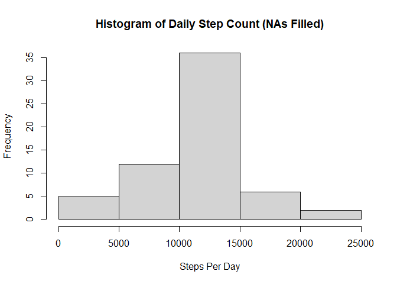

## Loading and preprocessing the data

        library(dplyr)

    ## Warning: package 'dplyr' was built under R version 4.2.2

    ## 
    ## Attaching package: 'dplyr'

    ## The following objects are masked from 'package:stats':
    ## 
    ##     filter, lag

    ## The following objects are masked from 'package:base':
    ## 
    ##     intersect, setdiff, setequal, union

        datadest <- "activity.zip"
        dataname <- unzip(datadest, list=TRUE)$Name
        unzip(datadest)
        dforig <- read.csv(dataname)
        df <- dforig[!is.na(dforig$steps),]

## What is mean total number of steps taken per day?

    stepsums <- as.data.frame(df %>% group_by(date) %>% summarise(totalsteps=sum(steps), .groups='drop'))
    meansteps <- mean(stepsums$totalsteps)
    medsteps <- median(stepsums$totalsteps)
    hist(stepsums$totalsteps,xlab="Steps Per Day",main="Histogram of Daily Step Count")

The mean number of steps taken per day is 1.0766189^{4}. The median
number of steps taken per day is 10765.

## What is the average daily activity pattern?

    stepmeans <- as.data.frame(df %>% group_by(interval) %>% summarise(meansteps=mean(steps), .groups='drop'))
    maxstepint <- stepmeans[stepmeans$meansteps == max(stepmeans$meansteps),]
    plot(stepmeans$interval,stepmeans$meansteps,type='l',xlab='Time Interval (min)',ylab='Average Daily Steps',main='Average Steps Taken in each Time Interval')

The interval that contains the maximum average number of steps is 835
minutes.

## Imputing missing values

    totalmissingvals <- sum(is.na(dforig$steps))
    uints <- unique(dforig$interval)
    dffilled <- read.csv(dataname)
    for (tpts in uints) {
      dffilled[dffilled$interval == tpts & is.na(dffilled$steps),1] = round(stepmeans[stepmeans$interval == tpts,2])
    }
    totalmissingvals1 <- sum(is.na(dffilled$steps))

    stepsumsf <- as.data.frame(dffilled %>% group_by(date) %>% summarise(totalsteps=sum(steps), .groups='drop'))
    meanstepsf <- mean(stepsumsf$totalsteps)
    medstepsf <- median(stepsumsf$totalsteps)
    dmeanf <- meanstepsf - meansteps
    dmedf <- medstepsf - medsteps
    hist(stepsumsf$totalsteps,xlab="Steps Per Day",main="Histogram of Daily Step Count (NAs Filled)")

The total number of missing values in the dataset is 2304.  
The missing values were filled with the mean of the interval for all
days where data was available.  
The mean total number of daily steps in the new dataset is
1.0765639^{4}. The median is 1.0762^{4}.  
The difference between the mean with imputed values and the mean with
missing values is -0.549335. The difference between medians is -3.

## Are there differences in activity patterns between weekdays and weekends?

    library(lattice)
    dffilled$date <- as.Date(dffilled$date)
    dffilled <- dffilled %>% mutate(daytype = factor(weekdays(date) == "Saturday" | weekdays(date) == "Sunday", labels = c("weekday","weekend")))
    avgww <- as.data.frame(dffilled %>% group_by(interval,daytype) %>% summarise(meansteps=mean(steps), .groups='drop'))
    avgww <- avgww[order(avgww$daytype,avgww$interval),]
    xyplot(meansteps~interval | daytype, data = avgww,
           type='l',
           layout=c(1,2),
           xlab="Interval (minutes)",
           ylab="Average Steps")

On weekdays, there is a high peak in steps at 835 minutes and on
weekends activity is more evenly distributed throughout the day.
